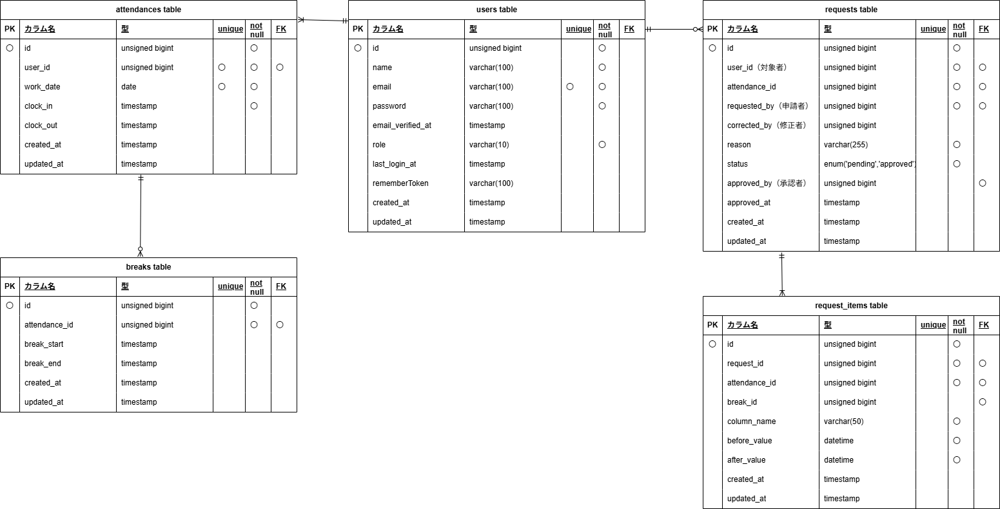

# mock-case2　勤怠管理  
  
## 目的  
模擬案件として勤怠管理アプリの作成を行う。  
簡易的な勤怠アプリで、勤務開始・勤務終了・休憩処理（複数可）の処理が可能。  
変更申請は複数まとめて実施可能。管理者が承認を行う。  
また管理者が勤怠登録をする場合は一般ユーザーとして別のメールアドレスで登録してあることを前提とする。  
夜勤や休日管理などの要件はなし  
変更申請の内容については変更前との差異を表示しない設計なので、ユーザーが備考に詳細を記入するものとして取り扱う。  
  
## 環境構築  
- Ubuntu使用にて構築  
  
## Dockerビルド  
- git clone git@github.com:ErikoKikuchi/mock-case2.git  
- cd mock-case2  
- git remote set-url origin 作成したﾘﾎﾟﾘｼﾞﾄﾘのURL  
- docker compose up -d --build  
  
## Laravel環境構築  
- docker compose exec php bash  
- 【PHPコンテナ内】composer install  
- 【PHPコンテナ内】開発環境を立ち上げる場合はcomposer create-project "laravel/laravel=12.*" . --prefer-dist  
- 開発環境では Asia/Tokyo に設定済  
- 【rootディレクトリ】必要あれば権限設定　sudo chmod -R 777 src/*(windowsの場合)  
- 【PHPコンテナ内】cp .env.example .env  
（DB_CONNECTION=mysql,DB_HOST=mysql, DB_DATABASE=laravel_db, DB_USERNAME=laravel_user, DB_PASSWORD=laravel_pass）  
- 【PHPコンテナ内】php artisan key:generate  
- 【PHPコンテナ内】php artisan migrate  
- 【PHPコンテナ内】php artisan db:seed  
- このプロジェクトではviteを使用しています。フロントエンドのビルドには Node.js と npm が必要です。Node.js / npm のインストールおよび `npm install` はホスト環境（srcディレクトリ）で行ってください。(package.jsonはsrcディレクトリにあります。)  
- 【rootディレクトリ】curl -fsSL https://deb.nodesource.com/setup_22.x | sudo -E bash -  
- 【rootディレクトリ】sudo apt-get install -y nodejs  
- 【srcディレクトリ】npm install  
- vite.config.js で build.outDir を設定（vite.config.jsからの相対パス）,app.jsに読み込むファイルを設定  
- 【srcディレクトリ】npm run dev(開発環境のため、srcディレクトリで実施)  
  
## メール認証について
- 本アプリでは、開発環境におけるメール送信確認のためにMailtrap の Email Sandbox を使用しています。  
- 要件仕様により Mailtrap を利用していますが、リポジトリには個人の認証情報は含まれていません。クローン後にメール機能を使用する場合は、各自で Mailtrap アカウントを作成し、.env に下記の設定してください。  
- MAIL_MAILER=smtp  
- MAIL_HOST=sandbox.smtp.mailtrap.io  
- MAIL_PORT=2525  
- MAIL_USERNAME=（MailtrapのUSERNAME）  
- MAIL_PASSWORD=（MailtrapのPASSWORD）  
- MAIL_FROM_ADDRESS="hello@example.com"  
- MAIL_FROM_NAME="${APP_NAME}"  
- MAILTRAP_SANDBOX_URL=個人URL  
- その後設定反映を実行　php artisan config:clear  
  
## 開発環境  
- 会員登録画面（http://localhost/register）  
　　（画面フロー：初期登録→メール認証→勤怠登録画面）  
- 一般ユーザーログイン画面（http://localhost/login）  
　　（画面フロー：ログイン→勤怠登録画面）  
- 一般ユーザーナビ（勤怠・勤怠一覧・申請・ログアウト）  
- 一般ユーザー申請フロー：  
　　①勤怠一覧→詳細ボタン押下→申請画面（承認待ち中は申請不可）→申請後は  
　　②申請一覧（承認待ち・承認済）→詳細ボタン押下→申請画面（承認待ち中は申請不可）  
- 管理者ログイン画面（http://localhost/admin/login）  
　　（画面フロー：ログイン→その日の勤怠情報一覧）  
- 管理者ユーザーナビ（勤怠一覧・スタッフ一覧・申請一覧・ログアウト）  
- 管理者ユーザー画面フロー：  
　　①勤怠情報一覧→詳細ボタン押下→申請画面  
　　②スタッフ一覧→各スタッフの勤怠一覧→詳細ボタン押下→申請画面  
　　③申請一覧（承認待ち・承認済）→詳細ボタン押下→承認画面→承認ボタンを押すと承認済へ変更  
- 管理者ユーザーおよび一般ユーザー各１名用意済  
　　①管理者　name:admin user ,email:admin@example.com ,password:adminpass  
　　②一般ユーザー　name:test user ,email:user@example.com, password:password  
  
## 開発時の注意事項
  
### 複数ロールの同時ログインについて
ユーザーと管理者を同一ブラウザで同時にログインすると419エラーが発生します。
Laravelのセッション構造上、同一ブラウザでは1セッションのみ有効です。

**動作確認時の手順**  
- ユーザー：通常ブラウザ  
- 管理者：シークレットモード（または別ブラウザ）  
  
## テスト用には下記の通り環境構築  
- mysqlコンテナにrootユーザーでログインし'demo_test'データベースを作成  
- config/database.phpの修正（'database' => 'demo_test','username' => 'root','password' => 'root'）  
- cp .env .env.testingを用意（APP_ENV=test, APP_KEY=  , DB_DATABASE=demo_test, DB_USERNAME=root, DB_PASSWORD=root, MAILTRAP_SANDBOX_URL=https://example.test/）  
- php artisan key:generate --env=testing  
- php artisan migrate --env=testing  
- phpunit.xmlの編集（env name="DB_CONNECTION" value="mysql_test"/, env name="DB_DATABASE" value="demo_test"/）  
- php artisan storage:link  
- php artisan test  
- このプロジェクトではviteを使用しています。テスト実行時に `public/build/manifest.json` が必要ですが、本プロジェクトでは testing 環境では Vite を読み込まない構成にしているため、テスト実行のために npm build を行う必要はありません。  

## 使用技術(実行環境)  
- php:8.4.18-fpm  
- Laravel:12.53.0  
- MySQL:8.4.7  
- nginx:1.28.2  
- node:22.22.0  
- npm:10.9.4  
  
## ER図・データベース設計  
   
